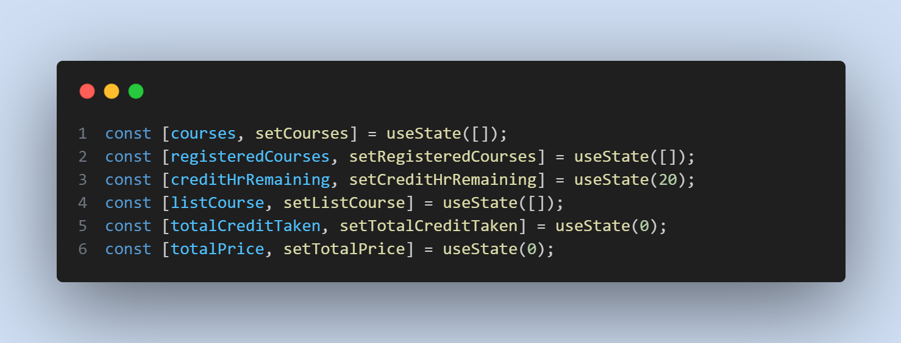

# Welcome to Basic React Assignment (Course Registration Project)

  

## Live Links:
- Netlify (Primary): [Click Here](https://course-registration-a5bc81.netlify.app/)
- Surge (Secondary): [Click Here](http://living-boys.surge.sh/)

  

## Question Answers

 

### 1. Project Features

- User can add new course to the course list.
- Credit hour remaining set to `20`, Credit taken set to `0`, Total Cost set to `0`, *`No course added`* text added dynamically by default.
- **Remaining Credit**, **Course Name List**, **Total Credit** and **Total Price** will change after a successful course added to registration.
- If new course credit is less than or equal to remaining credit, course will be added to course list under "**Course Name**".
- If a course is added previously, a **warning toast** will appear when try to add same course and won't added again to course list.
- If a course credit is grater than remaining credit, an **error toast** will be shown when try to add that course and won't added to course list.
- If courses' total credit is equal to maximum credit (**20**), a **success toast** will appear
- Project is compatible (**responsive**) to all devices (`i.e.` ***Mobile***, ***Tablet***, ***Laptop***, ***Desktop***)

 

### 2. How I managed the state in this assignment project

- I've used a total of **six** states in this project.

- Each get updated and hold data after any side effect or a new course is added. Individually,
    - `courses` hold all course data from JSON after `fetch()`
    - `registeredCourses` hold *registered courses data* after a new course is added
    - `creditHrRemaining` hold *credit hour remaining* after a new course is added
    - `listCourse` hold *all registered course name as an array of strings* after a new course is added
    - `totalCreditTaken` hold *credit taken* after a new course is added
    - `totalPrice` hold *total price* after a new course is added
- All this states are declared in both **Courses** and **RegistrationSummary**'s common parent **Main.jsx** so that the states can be shared and update accordingly.
- Event handler for **Select** button is clicked inside a *child* component of **Courses** that trigger in parent component **Main** as the event is shared from grandparent *(`Main.jsx`)* to child *(`Course.jsx`)* component as props and states are updated according to description using event handler function.

    

# React + Vite

This template provides a minimal setup to get React working in Vite with HMR and some ESLint rules.

Currently, two official plugins are available:

- [@vitejs/plugin-react](https://github.com/vitejs/vite-plugin-react/blob/main/packages/plugin-react/README.md) uses [Babel](https://babeljs.io/) for Fast Refresh
- [@vitejs/plugin-react-swc](https://github.com/vitejs/vite-plugin-react-swc) uses [SWC](https://swc.rs/) for Fast Refresh
